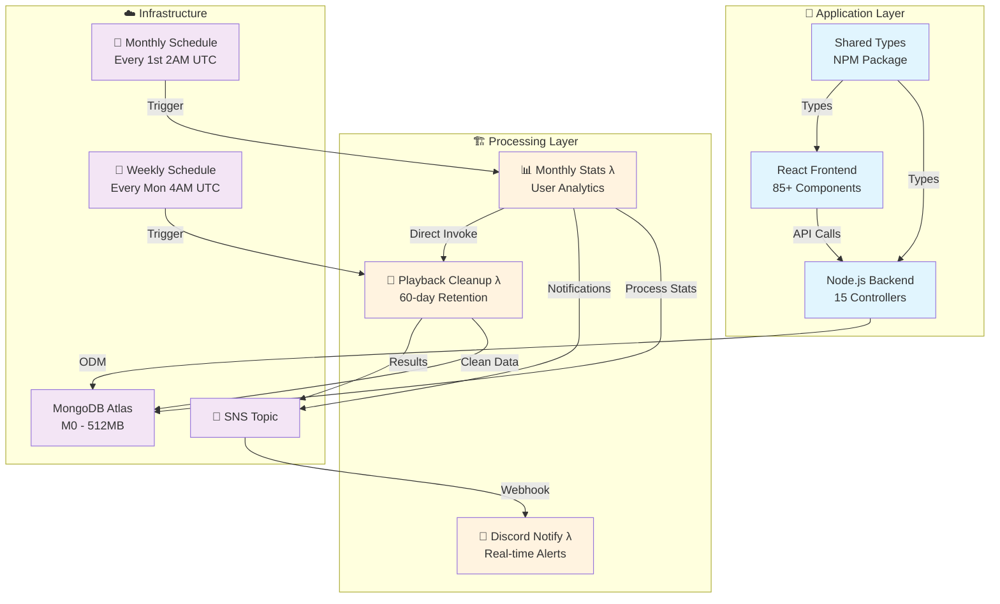

# Joytify - Full-Stack Music Platform

A Spotify-inspired music streaming platform built with modern web technologies, featuring user authentication, music upload/playback, playlist management, and automated data processing.

## 📋 Project Documentation

- **🏠 [Main Application](./README.md)** - Application overview, tech stack, features *(You are here)*
- **🏗️ [Infrastructure Pipeline](./terraform/README.md)** - AWS Lambda processing pipeline, capacity analysis
- **📚 [Shared Types](./share/README.md)** - Shared TypeScript interfaces

---

## 🎯 Project Overview

**Live Demo**: [Joytify Platform](https://joytify.vercel.app)

Joytify is a full-stack music streaming platform that allows users to upload, organize, and stream music. The platform includes user authentication, playlist management, internationalization, and fully automated, scalable statistics processing.

## 🎵 Platform Features

### Core Music Features
- **🎧 Audio Player** - Full-featured music streaming with queue management
- **📋 Playlist Management** - Create, edit, and organize music collections  
- **🎤 Artist Platform** - Music upload and album management
- **🔍 Search & Discovery** - Find music, artists, and playlists

### User Experience
- **🌐 Multi-language Support** - Full i18n with 6 languages (en-US, zh-CN, zh-TW, ja, ko, ms)
- **👤 User Profiles** - Complete profile and preference management
- **🔐 Authentication** - Firebase Auth + JWT security
- **📱 Device Management** - Multi-device session handling
- **🔔 Notifications** - Real-time notification system

---

## 🛠️ Tech Stack

### Frontend

- **React 18** + **TypeScript** – Modern, performant UI with type safety
- **Vite** – Blazing fast build tooling
- **TailwindCSS** – Utility-first styling
- **Zustand** – Lightweight client-side state management
- **React Query** – Server state synchronization and caching
- **React Hook Form** – Scalable and performant form management
- **React Intl** – Internationalization with support for `en-US`, `zh-CN`, `zh-TW`, `ja`, `ko`, `ms`
- **Skeleton Loading** – Improved user experience during data fetching
- **Firebase Auth** – Secure user authentication

### Backend

- **Node.js** + **Express** + **TypeScript** – Robust and scalable backend
- **Zod** – Input validation and runtime schema checking
- **MongoDB** + **Mongoose** – NoSQL database with ODM abstraction
- **JWT** – Secure token-based authentication
- **Firebase Admin SDK** – Admin-level user management
- **Resend** – Transactional email delivery (e.g., email verification)

### DevOps & Infrastructure

- **Terraform** – Infrastructure as Code (IaC)
- **AWS Lambda** – Serverless compute for backend processing
- **AWS SNS** – Pub/sub event notifications
- **AWS CloudWatch** – Scheduled tasks, metrics, and log management
- **Discord Webhook** – Real-time alert and execution summaries

### Shared Types

- **Monorepo Architecture** – Shared TypeScript interfaces between frontend and backend
- **Private NPM Package** – Shared types are uploaded to a private NPM registry for seamless reuse across environments

---

## 🔄 Current Processing Pipeline

### System Architecture

### Current Implementation Features

- **📊 Monthly Statistics**: Automated user engagement analysis
- **🧹 Data Cleanup**: Intelligent 60-day retention policy
- **🔔 Real-time Monitoring**: Discord notifications for system health
- **📈 Scalable Design**: Handles 100K+ users efficiently

**📖 [→ Detailed Infrastructure Documentation](./terraform/README.md)**

### Future Scalability (Conceptual)

For larger datasets, the system can be extended with:
- **Distributed Processing**: Multiple Lambda executors
- **Dynamic Scheduling**: Configurable processing intervals
- **Stage-based Processing**: Chunk large datasets into manageable stages
- **Enhanced Monitoring**: Per-stage progress tracking

---

## ⚙️ Current System Configuration

| Component                 | Value                      |
| ------------------------- | -------------------------- |
| **📅 Monthly Schedule**   | 1st of every month, 2AM UTC |
| **📅 Weekly Schedule**    | Every Monday, 4AM UTC        |
| **💾 Lambda Memory**      | 1024MB (configurable)       |
| **⏰ Lambda Timeout**     | 15 minutes (AWS limit)      |
| **🗂️ Batch Size**        | 10,000 records per batch    |
| **🔄 Max Concurrency**   | 15 concurrent operations    |
| **🗄️ Data Retention**    | 60 days (configurable)      |
| **💰 Monthly Cost**      | <$1 (serverless)            |

---

## 🚀 Summary

Joytify is a modern, end-to-end music platform that demonstrates:

- Scalable cloud-first architecture
- Real-time data processing pipelines
- Shared type safety across full stack
- Solid DevOps and cost awareness
- Production-grade observability and error handling

This project showcases the ability to build, deploy, and monitor a robust system designed to scale with real-world use cases.
