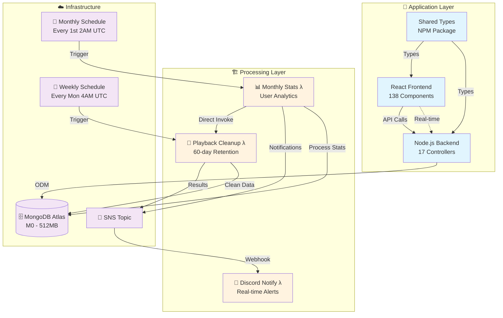

<!-- 有刪除帳號協議頁面 -->
<!-- 有音樂權轉讓協議 -->
<!-- 手刻組件，包括 input，menu 等 -->

#  Joytify - Full-Stack Music Platform

> A Spotify-inspired music streaming platform built with modern web technologies, featuring user authentication, music upload/playback, playlist management, song rating system, and automated data processing.

## 📋 Project Documentation

- **🏠 [Main Application](./README.md)** - Application overview, tech stack, features _(You are here)_
- **🏗️ [Infrastructure Pipeline](./terraform/README.md)** - AWS Lambda processing pipeline, capacity analysis
- **📚 [Shared Types](https://github.com/JIAN11442/joytify-shared-types)** - Shared TypeScript interfaces
- **📡 [API Documentation](https://documenter.getpostman.com/view/31719938/2sB3B7Msyz)** - Complete REST API reference with sample requests/responses

---

## 📋 Table of Contents

- [🎯 Project Overview](#-project-overview)
- [🎵 Platform Features](#-platform-features)
- [🛠️ Tech Stack](#-tech-stack)
- [🏗️ System Architecture](#-system-architecture)
- [🚀 Quick Start](#-quick-start)

---

## 🎯 Project Overview

**Development Status**: Currently in local development with full-stack implementation complete. Cloud deployment roadmap in progress.

Joytify is a full-stack music streaming platform that allows users to upload, organize, and stream music. The platform includes user authentication, playlist management, intelligent song rating system, internationalization, and fully automated, scalable statistics processing.

<!--
<div align="center">
  
  
  <br>
  <em>Application overview and music player interface</em>
</div>
-->

## 🎵 Platform Features

### Core Music Features

- **🎧 Audio Player** - Full-featured streaming with loop modes, shuffle, queue management
- **📋 Playlist Management** - Create playlists and assign songs with statistics tracking
- **🎤 Music Upload** - Upload with comprehensive metadata (lyrics, tags, languages, genres)
- **🔍 Artist System** - Artist profiles with follow functionality
- **⭐ Song Rating** - 5-star rating with comments and intelligent prompting
- **📅 Album Management** - Album creation and organization
- **📊 Playback Analytics** - Detailed listening statistics and monthly insights

### User Experience

- **🔐 Authentication** - Firebase Auth + JWT with session management
- **🌐 Multi-language Support** - Modular i18n system supporting 6 languages (en-US, zh-CN, zh-TW, ja, ko, ms) with easy expansion capability
- **🎨 Dynamic Theming** - Auto color palette extraction from album artwork
- **🔔 Real-time Notifications** - Live updates via Socket.io for uploads and announcements
- **📊 Analytics Dashboard** - Monthly listening insights with animated visualizations
- **📱 Multi-device Sessions** - Cross-device session tracking with automated heartbeat and online status management
- **📧 Email System** - Professional React Email templates for verification and notifications

<!--
<div align="center">
  
  
  <br>
  <em>Analytics dashboard and multi-language support</em>
</div>
-->

---

## 🛠️ Tech Stack

### Frontend

- **React 18** + **TypeScript** – Modern, performant UI with type safety
- **Vite** – Blazing fast build tooling with hot module replacement
- **TailwindCSS** – Utility-first styling with dynamic color theming
- **Zustand** (16 stores) – Granular state management across application domains
- **React Query** – Server state synchronization and caching
- **React Hook Form** – Scalable and performant form management
- **React Intl** – Internationalization with 6-language support
- **Firebase Auth** + **JWT** – Secure dual authentication flow
- **Socket.IO Client** – Real-time notifications with token validation
- **Recharts** + **Odometer.js** – Animated data visualization and statistics
- **Custom Hook Architecture** – 30+ hooks for feature-specific logic
- **Skeleton Loading** – Theme-aware loading components with multiple patterns (Image, Text, DeviceList)

### Backend

- **Node.js** + **Express** + **TypeScript** – Robust and scalable backend
- **Zod** – Input validation and runtime schema checking
- **MongoDB** + **Mongoose** – NoSQL database with ODM abstraction
- **JWT** + **Firebase Auth** – Dual authentication with HTTP-only cookies
- **Multi-tier API Keys** – Internal and admin-level access control
- **Sharp** + **Node Vibrant** – Image processing and color palette extraction
- **React Email** + **Resend** – Component-based email templates and delivery
- **Socket.IO** – Real-time notifications with authentication middleware

### DevOps & Infrastructure

- **Terraform** – Infrastructure as Code (IaC)
- **AWS Lambda** – Serverless compute for backend processing
- **AWS SNS** – Pub/sub event notifications
- **AWS CloudWatch** – Scheduled tasks, metrics, and log management
- **Discord Webhook** – Real-time alert and execution summaries

### Development & Architecture

- **Monorepo Architecture** – Shared TypeScript interfaces between frontend and backend
- **Private NPM Package** – ESM/CJS dual builds for cross-environment compatibility
- **Database Seeding** – Multi-language label system and development data tools
- **Keyboard Shortcuts Provider** – Debounced key processing with user preference persistence
- **Component Composition** – 138 React components (PlaybackControls, RatingModal, AuthButton) with reusable patterns

---

## 🏗️ System Architecture



Joytify follows a modern three-layer architecture:

- **🎵 Application Layer**: React frontend (138 components) with Node.js backend (17 controllers), sharing types via NPM package
- **🏗️ Processing Layer**: Scheduled AWS Lambda functions for statistics generation and data cleanup
- **☁️ Infrastructure**: Serverless architecture with CloudWatch schedules, SNS messaging, and MongoDB Atlas

The system uses automated data processing with serverless backend functions, currently optimized for MongoDB M0 (512MB) with scalable architecture design.

<!--
<div align="center">
  
  
  <br>
  <em>Real-time notifications and intelligent rating system</em>
</div>
-->

## 🚀 Quick Start

### Prerequisites

- Node.js 18+
- MongoDB Atlas account
- AWS account (for Lambda functions)

### Installation

**1. Clone the repository**

```bash
git clone https://github.com/JIAN11442/MERN-Joytify.git
cd MERN-Joytify
```

**2. Install dependencies**

```bash
cd backend && npm install
cd ../frontend && npm install
```

**3. Set up environment variables**

```bash
cp backend/.env.example backend/.env
cp frontend/.env.example frontend/.env
```

Key environment variables needed:

- `MONGODB_CONNECTION_STRING` - Database connection
- `ACCESS_SECRET_KEY` - JWT authentication
- `FIREBASE_PROJECT_ID` - Firebase configuration
- `AWS_ACCESS_KEY_ID` - S3 file storage
- `RESEND_API_KEY` - Email service
- ...

See `.env.example` files for complete configuration details.

**4. Start development servers**

```bash
cd backend && npm run dev
cd ../frontend && npm run dev
```

### Environment Setup

See the [Backend](./backend/) and [Frontend](./frontend/) directories for detailed configuration and setup instructions.
