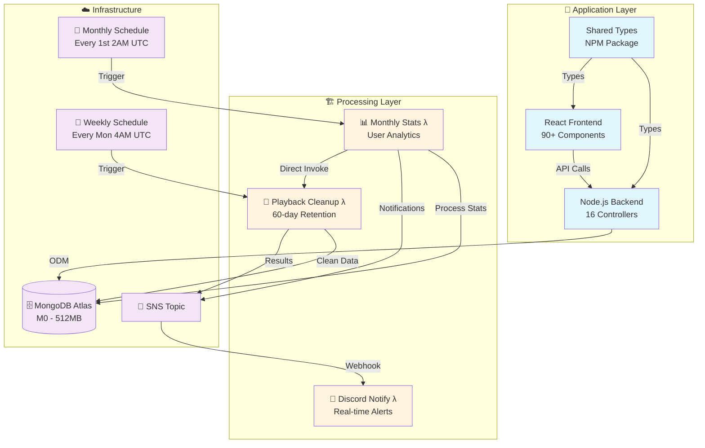

#  Joytify - Full-Stack Music Platform

> A Spotify-inspired music streaming platform built with modern web technologies, featuring user authentication, music upload/playback, playlist management, and automated data processing.

## 📋 Project Documentation

- **🏠 [Main Application](./README.md)** - Application overview, tech stack, features _(You are here)_
- **🏗️ [Infrastructure Pipeline](./terraform/README.md)** - AWS Lambda processing pipeline, capacity analysis
- **📚 [Shared Types](https://github.com/JIAN11442/joytify-shared-types)** - Shared TypeScript interfaces

---

## 📋 Table of Contents

- [🎯 Project Overview](#-project-overview)
- [🎵 Platform Features](#-platform-features)
- [🛠️ Tech Stack](#-tech-stack)
- [🏗️ System Architecture](#-system-architecture)
- [🚀 Quick Start](#-quick-start)

---

## 🎯 Project Overview

**Live Demo**: Coming Soon

Joytify is a full-stack music streaming platform that allows users to upload, organize, and stream music. The platform includes user authentication, playlist management, internationalization, and fully automated, scalable statistics processing.

## 🎵 Platform Features

### Core Music Features

- **🎧 Audio Player** - Full-featured music streaming with queue management
- **📋 Playlist Management** - Create, edit, and organize music collections
- **🎤 Artist Platform** - Music upload and album management
- **🔍 Search & Discovery** - Find music, artists, and playlists

### User Experience

- **🔐 Authentication** - Firebase Auth + JWT security
- **👤 User Profiles** - Complete profile and preference management
- **⚙️ User Preferences** - Locale settings, sidebar collapsed state, playback history (music, loop mode, volume)
- **🌐 Multi-language Support** - Full i18n with 6 languages (en-US, zh-CN, zh-TW, ja, ko, ms)
- **📱 Device Management** - Multi-device session handling
- **⌨️ Platform Shortcuts** - Keyboard shortcuts for enhanced user experience
- **🔔 Notifications** - Real-time notification system
- **📊 Analytics Dashboard** - Monthly statistics with animated data visualization

---

## 🛠️ Tech Stack

### Frontend

- **React 18** + **TypeScript** – Modern, performant UI with type safety
- **Vite** – Blazing fast build tooling
- **TailwindCSS** – Utility-first styling
- **Zustand** – Lightweight client-side state management
- **React Query** – Server state synchronization and caching
- **React Hook Form** – Scalable and performant form management
- **React Intl** – Internationalization with support for `en-US`, `zh-CN`, `zh-TW`, `ja`, `ko`, `ms`
- **Skeleton Loading** – Improved user experience during data fetching
- **Firebase Auth** – Secure user authentication
- **Socket.IO Client** – Real-time communication for notifications
- **Recharts** – Data visualization for analytics dashboard
- **Odometer.js** – Animated number display for statistics

### Backend

- **Node.js** + **Express** + **TypeScript** – Robust and scalable backend
- **Zod** – Input validation and runtime schema checking
- **MongoDB** + **Mongoose** – NoSQL database with ODM abstraction
- **JWT** – Secure token-based authentication
- **Firebase Admin SDK** – Admin-level user management
- **Resend** – Transactional email delivery (e.g., email verification)
- **Socket.IO** – Real-time communication for notifications

### DevOps & Infrastructure

- **Terraform** – Infrastructure as Code (IaC)
- **AWS Lambda** – Serverless compute for backend processing
- **AWS SNS** – Pub/sub event notifications
- **AWS CloudWatch** – Scheduled tasks, metrics, and log management
- **Discord Webhook** – Real-time alert and execution summaries

### Shared Types

- **Monorepo Architecture** – Shared TypeScript interfaces between frontend and backend
- **Private NPM Package** – Shared types are uploaded to a private NPM registry for seamless reuse across environments

---

## 🏗️ System Architecture



Joytify follows a modern three-layer architecture:

- **🎵 Application Layer**: React frontend (90+ components) with Node.js backend (16 controllers), sharing types via NPM package
- **🏗️ Processing Layer**: AWS Lambda functions for monthly statistics, data cleanup, and real-time notifications
- **☁️ Infrastructure**: CloudWatch schedules, SNS messaging, and MongoDB Atlas database

The system processes user analytics monthly and maintains data retention policies automatically.

## 🚀 Quick Start

### Prerequisites

- Node.js 18+
- MongoDB Atlas account
- AWS account (for Lambda functions)

### Installation

**1. Clone the repository**

```bash
git clone https://github.com/JIAN11442/MERN-Joytify.git
cd MERN-Joytify
```

**2. Install dependencies**

```bash
cd backend && npm install
cd ../frontend && npm install
```

**3. Set up environment variables**

```bash
cp backend/.env.example backend/.env
cp frontend/.env.example frontend/.env
```

**4. Start development servers**

```bash
cd backend && npm run dev
cd ../frontend && npm run dev
```

### Environment Setup

See the [Backend](./backend/) and [Frontend](./frontend/) directories for detailed configuration and setup instructions.
