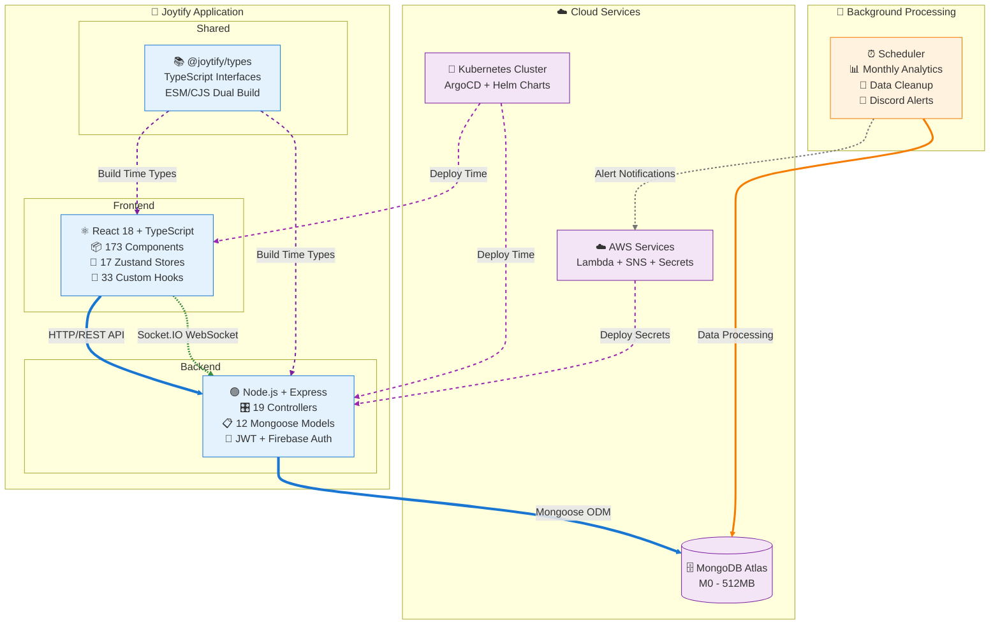

#  Joytify - Full-Stack Music Platform

> A Spotify clone music streaming platform built with modern web technologies, featuring user authentication, music upload/playback, playlist management, song rating system, and automated data processing.

## 📋 Project Documentation

### Application Components

- **🏠 [Main Application](https://github.com/JIAN11442/joytify-app)** - Frontend, backend, and core features _(You are here)_
- **⏰ [Scheduler](https://github.com/JIAN11442/joytify-app/tree/main/scheduler)** - Serverless data processing and analytics
- **📚 [Shared Types](https://github.com/JIAN11442/joytify-shared-types)** - TypeScript interfaces and constants
- **📡 [API Documentation](https://documenter.getpostman.com/view/31719938/2sB3B7Msyz)** - REST API reference

### Deployment & Infrastructure

- **⚙️ [GitHub Workflows](https://github.com/JIAN11442/joytify-app/tree/main/.github)** - CI/CD automation
- **🚀 [Kubernetes Infrastructure](https://github.com/JIAN11442/joytify-infra)** - Platform services and GitOps
- **📦 [Helm Charts](https://github.com/JIAN11442/joytify-helm)** - Application deployment configurations

---

## 📋 Table of Contents

- [🎵 Try Joytify](#-try-joytify)
- [🎵 Platform Features](#-platform-features)
- [🛠️ Tech Stack](#️-tech-stack)
- [🏗️ System Architecture](#️-system-architecture)
- [🔄 CI/CD Pipeline](#-cicd-pipeline)
- [🚀 Development Setup](#-development-setup)

---

## 🎵 Try Joytify

**Live Application**: [https://joytify.org](https://joytify.org)

### **Demo Account**

For quick access without registration, use these demo credentials:

- **Email**: `test35@gmail.com`
- **Password**: `Test35`

> **💡 Note:** This demo account comes pre-loaded with sample playlists, listening history, and following relationships to showcase the platform's full functionality.


## 🎵 Platform Features

### Core Music Features

- **🎤 Music Upload** - Upload with comprehensive metadata (lyrics, tags, languages, genres)
<p align="right">
  
  
</p>

- **🎧 Audio Player** - Full-featured streaming with loop modes, shuffle, queue management
<p align="right">
  
  
</p>

- **⭐ Song Rating** - 5-star rating with comments and intelligent prompting
<p align="right">
  
  
</p>

- **🎨 Following System** - Follow musicians and get real-time notifications for their updates
<p align="right">
  
  
</p>

- **🔍 Advanced Search** - Cross-collection search for songs, musicians, albums, and labels with intelligent filtering, pagination, and multi-type content display
<p align="right">
  
  
</p>

- **🎯 Intelligent Recommendations** - Personalized song, album, musician, and label recommendations based on user preferences and listening history
<p align="right">
  
  
</p>

- **📊 Playback Analytics** - Detailed listening statistics and monthly insights
<p align="right">
  
  
</p>

### Content Page Features

- **📁 Playlist page** - Create and manage playlists with song assignment, recommended songs, and detailed statistics tracking
<p align="right">
  
  
</p>

- **🎵 Song page** - Individual song details with hero section, action panel, comments, and profile information
<p align="right">
  
  
</p>

- **🎤 Musician page** - Artist profiles with hero section, discography, follower system, and recommended musicians
<p align="right">
  
  
</p>

- **💿 Album page** - Album collections with hero section, track listings, and recommended albums
<p align="right">
  
  
</p>

- **👤 Profile page** - User profiles with hero section, action panel, and personal music collections display
<p align="right">
  
  
</p>

- **⚙️ Management pages** - Content administration for songs, playlists, following, and notifications
<p align="right">
  
  
</p>

- **🔧 Settings pages** - User configuration for account, devices, languages, and notification preferences
<p align="right">
  
  
</p>

### User Experience Features

- **🔐 Authentication** - Complete registration/login system with email verification, JWT authentication (15-minute access tokens with automatic refresh via refresh tokens), and Firebase Auth integration for social login (Google, GitHub) with seamless session management
<p align="right">
  
  
</p>

- **📱 Multi-device Sessions** - Cross-device session tracking and automated heartbeat for online status management with 30-day session validity
<p align="right">
  
  
</p>

- **🌐 Multi-language Support** - Static i18n system supporting 6 languages (en-US, zh-CN, zh-TW, ja, ko, ms) with easy expansion capability
<p align="right">
  
  
</p>

- **🎨 Dynamic Theming** - Auto color palette extraction from images (songs, albums, playlists, musicians, users) with gradient hero sections
<p align="right">
  
  
</p>

- **⌨️ Keyboard Shortcuts** - Comprehensive keyboard shortcut system with 32+ actions across General, Navigation, and Playback categories, featuring centralized event handling and user preference persistence
<p align="right">
  
  
</p>

- **📧 Email System** - Professional React Email templates for verification and notifications
<p align="right">
  
  
</p>

- **⚖️ Legal Compliance** - Account deletion agreements and music rights transfer protocols for user protection and legal compliance
- **🍪 User Preferences** – Stores playback state, interface state, and personal settings in cookies for cross-session persistence (retains same state after re-login)
- **🔔 Real-time Notifications** - Live updates via Socket.io for uploads and announcements
- **📊 Analytics Dashboard** - Monthly listening insights with animated visualizations

---

## 🛠️ Tech Stack

### Frontend

- **React 18** + **TypeScript** – Modern, performant UI with type safety
- **Vite** – Blazing fast build tooling with hot module replacement
- **TailwindCSS** – Utility-first styling with dynamic color theming
- **Zustand** (17 stores) – Granular state management across application domains
- **TanStack React Query** – Server state synchronization and caching
- **React Hook Form** – Scalable and performant form management
- **React Intl** – Internationalization with 6-language support
- **Firebase Auth** + **JWT** – Secure dual authentication flow
- **Socket.IO Client** – Real-time notifications with token validation
- **Recharts** + **React Odometer** – Animated data visualization and statistics
- **Custom Hook Architecture** – 33 hooks for feature-specific logic
- **React Loading Skeleton** – Theme-aware loading components with multiple patterns
- **Framer Motion** – Smooth animations and micro-interactions
- **Radix UI** – Accessible UI primitives for dialogs and components

### Backend

- **Node.js** + **Express** + **TypeScript** – Robust and scalable backend
- **Zod** – Input validation and runtime schema checking
- **MongoDB** + **Mongoose** – NoSQL database with ODM abstraction
- **JWT** + **Firebase Admin** – Dual authentication with HTTP-only cookies
- **AWS SDK** – Cloud services integration for file storage and secrets
- **Sharp** + **Node Vibrant** – Image processing and color palette extraction
- **React Email** + **Resend** – Component-based email templates and delivery
- **Socket.IO** – Real-time notifications with authentication middleware
- **bcrypt** – Password hashing and security
- **Morgan** + **Log-box** – Request logging and debugging utilities

### Testing

- **Jest** + **TypeScript** – Comprehensive unit testing framework
- **Mocking Strategy** – Isolated testing with external dependency mocking
- **Coverage Analysis** – 49.05% overall coverage with 95.91% services layer coverage
- **Test Architecture** – 32 test suites, 591 tests focusing on critical business logic
- **Layer-Specific Coverage** – Extensions (100%), Hooks (100%), Schedules (100%), Utils (83.95%)

### Type Sharing & Architecture

- **Monorepo Type Sharing** – Shared TypeScript interfaces between frontend and backend with ESM/CJS dual builds for cross-environment compatibility

### DevOps & Infrastructure

- **Terraform** + **Terragrunt** – Infrastructure as Code with environment management
- **GitHub Actions** – CI/CD pipelines for testing, building, and deployment automation
- **AWS Lambda** – Serverless compute for background analytics and data processing
- **CloudWatch Events** – Scheduled triggers for automated maintenance tasks
- **SNS Topics** – Event-driven messaging and notification coordination
- **Discord Webhooks** – Real-time monitoring alerts and execution status updates
- **DigitalOcean Kubernetes** – Managed cluster with auto-scaling node pools
- **ArgoCD** – GitOps continuous deployment and application lifecycle management
- **NGINX Ingress Controller** – Load balancing, SSL termination, and traffic routing
- **cert-manager** – Automatic SSL certificate management with Let's Encrypt
- **External Secrets Operator** – AWS Secrets Manager integration for runtime configuration
- **Helm Charts** – Kubernetes application packaging and deployment automation

---

## 🏗️ System Architecture



**Application-Centric Architecture:**

### **🔄 Runtime Data Flow (Solid Lines)**

- **🔵 Primary API Flow**: React frontend communicates with Node.js backend via HTTP/REST API
- **🔵 Database Operations**: Backend persists data using Mongoose ODM to MongoDB Atlas
- **🟢 Real-time Communication**: WebSocket connections via Socket.IO for live notifications
- **🟠 Background Processing**: Lambda functions process analytics and cleanup operations

### **⚙️ Build & Deploy Dependencies (Dashed Lines)**

- **🟣 Type Sharing**: Shared TypeScript interfaces compiled at build time from monorepo package
- **🟣 Container Deployment**: Kubernetes orchestrates application deployment via ArgoCD GitOps
- **🟣 Secret Management**: AWS Secrets Manager provides runtime configuration during deployment
- **⚫ External Notifications**: Intermittent alerts sent to Discord for monitoring

### **📚 Detailed Architecture Documentation**

- **☁️ Infrastructure**: Kubernetes platform services and Terraform modules ([joytify-infra README](https://github.com/JIAN11442/joytify-infra))
- **🔄 Processing**: Serverless analytics and data cleanup pipeline ([scheduler README](https://github.com/JIAN11442/joytify-app/tree/main/scheduler))
- **📦 Deployment**: Helm charts and GitOps automation ([joytify-helm README](https://github.com/JIAN11442/joytify-helm))

> **💡 Deployment Flow:** For the complete CI/CD pipeline and GitOps workflow that deploys this architecture, see [CI/CD Pipeline](#-cicd-pipeline) section below.

---

## 🔄 CI/CD Pipeline

### **GitOps Integration & Role**

Joytify implements a **declarative GitOps workflow** where Git repositories serve as the single source of truth for both application code and deployment configuration. This architecture separates concerns and enables automated, auditable deployments.

**GitOps Principle:**

```
Git = Source of Truth → CI/CD Builds Artifacts → GitOps Updates Manifests → ArgoCD Reconciles State
```

**Key GitOps Benefits:**

- 🔒 **Version Control Everything** - All deployment states tracked in Git with full history
- 🔄 **Automated Synchronization** - ArgoCD continuously reconciles desired (Git) vs actual (K8s) state
- 📝 **Declarative Configuration** - Helm charts define "what", not "how"
- ↩️ **Easy Rollbacks** - Revert Git commits to restore previous deployment states
- 🔍 **Audit Trail** - Every deployment change has a Git commit with author and timestamp

**Three-Repository Architecture:**

| Repository                                                      | Role                    | Responsibility                              | Updated By        |
| --------------------------------------------------------------- | ----------------------- | ------------------------------------------- | ----------------- |
| **[joytify-app](https://github.com/JIAN11442/joytify-app)**     | Source Code             | Application logic, tests, Dockerfiles       | Developers        |
| **[joytify-helm](https://github.com/JIAN11442/joytify-helm)**   | Deployment Manifests    | Helm charts, values, image references       | CI/CD (automated) |
| **[joytify-infra](https://github.com/JIAN11442/joytify-infra)** | Platform Infrastructure | ArgoCD, ingress, secrets, platform services | DevOps/SRE        |

**GitOps Flow in Action:**

```
1. Developer pushes code to joytify-app
2. CI/CD builds & tests → Creates Docker images
3. CI/CD updates joytify-helm → Commits new image tags
4. ArgoCD detects Git change → Syncs to Kubernetes
5. Kubernetes executes rolling update → Zero-downtime deployment
   - New pods created with updated image
   - Health checks ensure new pods are ready
   - Old pods terminated gracefully
   - Traffic seamlessly shifted to new version
```

### **Pipeline Architecture**

```mermaid
graph LR
    subgraph "🔧 Source Control"
        A[📝 Code Push]
        B[🔍 PR Creation]
    end

    subgraph "🔍 Change Detection"
        C[📁 Path Filter<br/>backend/** / frontend/**<br/>Smart execution logic]
    end

    subgraph "🧪 Backend Testing"
        D1[⚡ Jest Testing<br/>32 test suites, 591 tests]
        D2[📊 Coverage Report<br/>95.91% services]
    end

    subgraph "🔐 AWS Secrets"
        E[🔑 Fetch Secrets<br/>Infrastructure + Runtime<br/>Environment config]
    end

    subgraph "📦 Backend Build"
        F1[🏗️ Docker Build<br/>Multi-stage optimization]
        F2[🔄 GHCR Push<br/>joytify-api image]
        F3[📝 Helm Update<br/>Backend values]
    end

    subgraph "📦 Frontend Build"
        G1[🏗️ Docker Build<br/>VITE build args]
        G2[🔄 GHCR Push<br/>joytify-web image]
        G3[📝 Helm Update<br/>Frontend values]
    end

    subgraph "🚀 GitOps"
        H[📦 Commit Charts<br/>joytify-helm repo]
        I[🔍 ArgoCD Sync<br/>Auto-deployment]
        J[☁️ K8s Deploy<br/>Rolling updates]
    end

    %% Main flow
    A --> C
    B --> C

    %% Backend path (if backend changed)
    C -->|backend: true| D1
    D1 --> D2
    D2 --> E
    E --> F1
    F1 --> F2
    F2 --> F3
    F3 --> H

    %% Frontend path (if frontend changed)
    C -->|frontend: true| E
    E --> G1
    G1 --> G2
    G2 --> G3
    G3 --> H

    %% Common deployment
    H --> I
    I --> J

    I -.->|Chart Details| K[joytify-helm README]
    J -.->|Infrastructure| L[joytify-infra README]

    classDef source fill:#e3f2fd,stroke:#1565c0,stroke-width:2px,color:#0d47a1
    classDef detection fill:#fff8e1,stroke:#f57c00,stroke-width:2px,color:#e65100
    classDef testing fill:#f3e5f5,stroke:#7b1fa2,stroke-width:2px,color:#4a148c
    classDef secrets fill:#fce4ec,stroke:#c2185b,stroke-width:2px,color:#880e4f
    classDef backend fill:#ffebee,stroke:#d32f2f,stroke-width:2px,color:#b71c1c
    classDef frontend fill:#e8f5e8,stroke:#2e7d32,stroke-width:2px,color:#1b5e20
    classDef deploy fill:#f3e5f5,stroke:#512da8,stroke-width:2px,color:#311b92

    class A,B source
    class C detection
    class D1,D2 testing
    class E secrets
    class F1,F2,F3 backend
    class G1,G2,G3 frontend
    class H,I,J deploy

    %% Common Initial Flow (Blue)
    linkStyle 0 stroke:#1565c0,stroke-width:2px
    linkStyle 1 stroke:#1565c0,stroke-width:2px

    %% Backend Path - if backend changed (Red)
    linkStyle 2 stroke:#d32f2f,stroke-width:2px
    linkStyle 3 stroke:#d32f2f,stroke-width:2px
    linkStyle 4 stroke:#d32f2f,stroke-width:2px
    linkStyle 5 stroke:#d32f2f,stroke-width:2px
    linkStyle 6 stroke:#d32f2f,stroke-width:2px
    linkStyle 7 stroke:#d32f2f,stroke-width:2px
    linkStyle 8 stroke:#d32f2f,stroke-width:2px

    %% Frontend Path - if frontend changed (Green)
    linkStyle 9 stroke:#2e7d32,stroke-width:2px
    linkStyle 10 stroke:#2e7d32,stroke-width:2px
    linkStyle 11 stroke:#2e7d32,stroke-width:2px
    linkStyle 12 stroke:#2e7d32,stroke-width:2px
    linkStyle 13 stroke:#2e7d32,stroke-width:2px

    %% Common Deployment (Blue)
    linkStyle 14 stroke:#1565c0,stroke-width:2px
    linkStyle 15 stroke:#1565c0,stroke-width:2px

    %% Reference Links (Gray - Dashed)
    linkStyle 16 stroke:#757575,stroke-width:2px,stroke-dasharray: 5 5
    linkStyle 17 stroke:#757575,stroke-width:2px,stroke-dasharray: 5 5
```



### **Quality Assurance Strategy**

**Smart Testing Execution:**

- **Conditional Testing**: Only runs when backend code changes detected via path filtering
- **32 test suites, 591 tests** targeting core business operations
- **Multi-Node Testing**: Matrix strategy supporting Node.js 18+ with fail-fast disabled
- **Dependency Isolation**: Mocked external services (Firebase, AWS, MongoDB)
- **Coverage Artifacts**: Test coverage reports uploaded and preserved for analysis
- **Concurrency Control**: Auto-cancels old workflow runs to prevent resource waste

**Layer-Specific Coverage:**

| Layer           | Coverage | Status       | Description                                                          |
| --------------- | -------- | ------------ | -------------------------------------------------------------------- |
| **Services**    | 95.91%   | ✅ Excellent | Business logic, database operations, error handling                  |
| **Utils**       | 83.95%   | 🟢 Good      | Authentication, encryption, JWT utilities                            |
| **Extensions**  | 100%     | 🟢 Complete  | Mongoose query extensions and custom methods                         |
| **Middlewares** | 43.61%   | 🟡 Selective | Error handler (100% tested). Auth middlewares tested via integration |
| **Hooks**       | 100%     | 🟢 Complete  | Custom hooks and business logic                                      |
| **Schedules**   | 100%     | 🟢 Complete  | Automated task scheduling                                            |

### **Container & Deployment Automation**

**Smart Build Strategy:**

- **Conditional Building**: Frontend/backend builds triggered only when respective code changes
- **Multi-stage Optimization**: `node:18-alpine` with layer caching and non-root security
- **GHCR Management**: SHA-based tagging with digest pinning for immutability
- **Image Retention**: Automated cleanup keeping latest 30 versions (tagged + untagged)
- **Multi-Platform Support**: Optimized builds for `linux/amd64` cloud deployments

**GitOps Workflow:**

- **Declarative Updates**: CI updates Helm values in Git, not direct K8s API calls
- **Separation of Concerns**: CI builds artifacts, ArgoCD handles deployment
- **Git as Source of Truth**: `joytify-helm` repo reflects current and desired cluster state
- **Automated Reconciliation**: ArgoCD polls Git every 3 minutes and syncs differences
- **Pull-based Deployment**: Cluster pulls changes from Git (more secure than CI pushing to cluster)
- **Loop Prevention**: `paths-ignore: helm/**` prevents circular workflow triggers

---

## 🚀 Development Setup

### **Prerequisites**

Before starting, ensure you have:

- **Node.js** 18+ and npm (tested on Node.js 18.x, 20.x)
- **MongoDB** 5.0+ (local installation or MongoDB Atlas account)
- **AWS Account** (for S3 file storage and Secrets Manager)
- **Firebase Project** (for Google/GitHub social authentication)
- **Docker** (optional, for containerized development)

**Recommended Tools:**

- **VS Code** with ESLint and Prettier extensions
- **MongoDB Compass** for database visualization
- **Postman** for API testing ([API Collection](https://documenter.getpostman.com/view/31719938/2sB3B7Msyz))

### **Quick Start**

For experienced developers who want to get started immediately:

```bash
# 1. Clone and install
git clone https://github.com/JIAN11442/joytify-app.git
cd joytify-app

# 2. Backend setup
cd backend && npm install
cp .env.example .env  # Edit with your credentials
npm run dev  # Runs on http://localhost:5000

# 3. Frontend setup (in new terminal)
cd ../frontend && npm install
cp .env.example .env  # Edit with VITE_SERVER_URL=http://localhost:5000
npm run dev  # Runs on http://localhost:5173

# 4. Visit http://localhost:5173 in your browser
```

> **⚠️ Note:** Make sure you have the prerequisites above installed and configured first. For detailed setup instructions, see the sections below.

### **Backend Setup**

```bash
# Navigate to backend directory
cd backend

# Install dependencies
npm install

# Set up environment variables
cp .env.example .env
# Edit .env with your actual credentials (see required variables below)

# Run tests to verify setup
npm test

# Start development server
npm run dev  # Runs on http://localhost:5000
```

**Key Environment Variables:**

The most important variables to configure:

```bash
# Database
MONGODB_URI=mongodb://localhost:27017/joytify

# Authentication
JWT_SECRET=your-secret-key-here
FIREBASE_PROJECT_ID=your-project-id

# AWS Services
AWS_ACCESS_KEY_ID=your-aws-access-key
AWS_SECRET_ACCESS_KEY=your-aws-secret-key

# Email Service
RESEND_API_KEY=your-resend-api-key

# ... and additional environment variables
```

> **📋 Complete Setup:** See `backend/.env.example` for the complete list of all required environment variables with descriptions.

**Available Scripts:**

- `npm run dev` - Start development server with hot reload
- `npm test` - Run all test suites
- `npm test -- --coverage` - Run tests with coverage report
- `npm run build` - Compile TypeScript to JavaScript

### **Frontend Setup**

```bash
# Navigate to frontend directory
cd frontend

# Install dependencies
npm install

# Set up environment variables
cp .env.example .env
# Edit .env with your configuration (see required variables below)

# Start development server
npm run dev  # Runs on http://localhost:5173
```

**Key Environment Variables:**

The most important variables to configure:

```bash
# Backend API
VITE_SERVER_URL=http://localhost:5000

# Firebase Client
VITE_FIREBASE_API_KEY=your-api-key
VITE_FIREBASE_PROJECT_ID=your-project-id

# Application Config
VITE_ENV=development

# ... and additional configuration variables
```

> **📋 Complete Setup:** See `frontend/.env.example` for the complete list of all required environment variables with descriptions.

**Available Scripts:**

- `npm run dev` - Start Vite development server
- `npm run build` - Build production bundle
- `npm run preview` - Preview production build locally
- `npm run lint` - Run ESLint

### **Running Tests**

```bash
# Backend tests
cd backend
npm test                 # Run all test suites
npm test -- --coverage   # Run with coverage report

# Frontend tests (coming soon)
cd frontend
npm test
```

### **Docker Development (Optional)**

```bash
# Build and run backend
cd backend
docker build -t joytify-api .
docker run -p 5000:5000 --env-file .env joytify-api

# Build and run frontend
cd frontend
docker build -t joytify-web .
docker run -p 80:80 joytify-web
```

> **💡 Production Note:** For production deployment, see the [CI/CD Pipeline](#-cicd-pipeline) section for automated Docker builds and Kubernetes deployment.

> **⚠️ Security Note:** Never commit `.env` files to version control. These files contain sensitive credentials.

---
