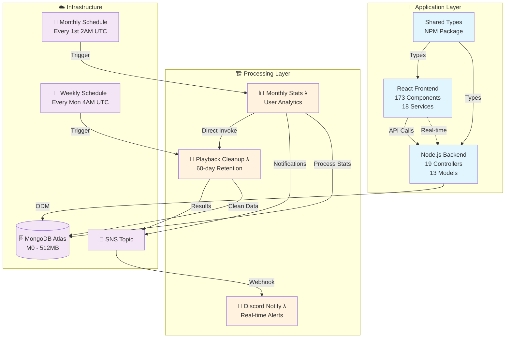

#  Joytify - Full-Stack Music Platform

> A Spotify-inspired music streaming platform built with modern web technologies, featuring user authentication, music upload/playback, playlist management, song rating system, and automated data processing.

## 📋 Project Documentation

- **🏠 [Main Application](./README.md)** - Application overview, tech stack, features _(You are here)_
- **🏗️ [Infrastructure Pipeline](./terraform/README.md)** - AWS Lambda processing pipeline, capacity analysis
- **📚 [Shared Types](https://github.com/JIAN11442/joytify-shared-types)** - Shared TypeScript interfaces
- **📡 [API Documentation](https://documenter.getpostman.com/view/31719938/2sB3B7Msyz)** - Complete REST API reference with sample requests/responses

---

## 📋 Table of Contents

- [🎯 Project Overview](#-project-overview)
- [🎵 Platform Features](#-platform-features)
- [🛠️ Tech Stack](#-tech-stack)
- [🏗️ System Architecture](#-system-architecture)
- [🚀 Quick Start](#-quick-start)
- [🧪 Testing Strategy](#-testing-strategy)

---

## 🎯 Project Overview

**Development Status**: Currently in local development with full-stack implementation complete. Cloud deployment roadmap in progress.

Joytify is a full-stack music streaming platform that allows users to upload, organize, and stream music. The platform includes user authentication, playlist management, intelligent song rating system, internationalization, and fully automated, scalable statistics processing.

<!--
<div align="center">
  
  
  <br>
  <em>Application overview and music player interface</em>
</div>
-->

## 🎵 Platform Features

### Core Music Features

- **🎤 Music Upload** - Upload with comprehensive metadata (lyrics, tags, languages, genres)
- **🎧 Audio Player** - Full-featured streaming with loop modes, shuffle, queue management
- **🎨 Following System** - Follow musicians and get real-time notifications for their updates
- **⭐ Song Rating** - 5-star rating with comments and intelligent prompting
- **🔍 Advanced Search** - Cross-collection search for songs, musicians, albums, and labels with intelligent filtering, pagination, and multi-type content display
- **📋 Playlist Management** - Create playlists and assign songs with statistics tracking
- **📊 Playback Analytics** - Detailed listening statistics and monthly insights
- **🎯 Intelligent Recommendations** - Personalized song, album, musician, and label recommendations based on user preferences and listening history

### User Experience

- **🔐 Authentication** - Custom registration/login system with JWT + Firebase Auth for third-party login (Google, GitHub), featuring automatic token refresh and seamless session management
- **📱 Multi-device Sessions** - Cross-device session tracking and automated heartbeat for online status management with 30-day session validity
- **🍪 User Preferences** – Stores playback state, interface state, and personal settings in cookies for cross-session persistence (retains same state after re-login)
- **🌐 Multi-language Support** - Static i18n system supporting 6 languages (en-US, zh-CN, zh-TW, ja, ko, ms) with easy expansion capability
- **🎨 Dynamic Theming** - Auto color palette extraction from images (songs, albums, playlists, musicians, users) with gradient hero sections
- **⌨️ Keyboard Shortcuts** - Comprehensive keyboard shortcut system with 32+ actions across General, Navigation, and Playback categories, featuring centralized event handling and user preference persistence
- **🔔 Real-time Notifications** - Live updates via Socket.io for uploads and announcements
- **📧 Email System** - Professional React Email templates for verification and notifications
- **📊 Analytics Dashboard** - Monthly listening insights with animated visualizations
- **⚖️ Legal Compliance** - Account deletion agreements and music rights transfer protocols for user protection and legal compliance

<!--
<div align="center">
  
  
  <br>
  <em>Analytics dashboard and multi-language support</em>
</div>
-->

---

## 🛠️ Tech Stack

### Frontend

- **React 18** + **TypeScript** – Modern, performant UI with type safety
- **Vite** – Blazing fast build tooling with hot module replacement
- **TailwindCSS** – Utility-first styling with dynamic color theming
- **Zustand** (17 stores) – Granular state management across application domains
- **React Query** – Server state synchronization and caching
- **React Hook Form** – Scalable and performant form management
- **React Intl** – Internationalization with 6-language support
- **Firebase Auth** + **JWT** – Secure dual authentication flow
- **Socket.IO Client** – Real-time notifications with token validation
- **Recharts** + **Odometer.js** – Animated data visualization and statistics
- **Custom Hook Architecture** – 33 hooks for feature-specific logic
- **Skeleton Loading** – Theme-aware loading components with multiple patterns (Image, Text, DeviceList)

### Backend

- **Node.js** + **Express** + **TypeScript** – Robust and scalable backend
- **Zod** – Input validation and runtime schema checking
- **MongoDB** + **Mongoose** – NoSQL database with ODM abstraction
- **JWT** + **Firebase Auth** – Dual authentication with HTTP-only cookies
- **Multi-tier API Keys** – Internal and admin-level access control
- **Sharp** + **Node Vibrant** – Image processing and color palette extraction
- **React Email** + **Resend** – Component-based email templates and delivery
- **Socket.IO** – Real-time notifications with authentication middleware

### Testing

- **Jest** + **TypeScript** – Comprehensive unit testing framework
- **Mocking Strategy** – Isolated testing with external dependency mocking
- **Coverage Analysis** – 49.7% overall coverage with 96% services layer coverage
- **Test Architecture** – 32 test suites with 600+ test cases

### Type Sharing & Architecture

- **Monorepo Type Sharing** – Shared TypeScript interfaces between frontend and backend with ESM/CJS dual builds for cross-environment compatibility

### DevOps & Infrastructure

- **Terraform** – Infrastructure as Code (IaC)
- **AWS Lambda** – Serverless compute for backend processing
- **AWS SNS** – Pub/sub event notifications
- **AWS CloudWatch** – Scheduled tasks, metrics, and log management
- **Discord Webhook** – Real-time alert and execution summaries

---

## 🏗️ System Architecture



Joytify follows a modern three-layer architecture:

- **🎵 Application Layer**: React frontend (173 components, 18 services) with Node.js backend (19 controllers, 13 models), sharing types via NPM package
- **🏗️ Processing Layer**: Scheduled AWS Lambda functions for statistics generation and data cleanup
- **☁️ Infrastructure**: Serverless architecture with CloudWatch schedules, SNS messaging, and MongoDB Atlas

The system uses automated data processing with serverless backend functions, currently optimized for MongoDB M0 (512MB) with scalable architecture design.

<!--
<div align="center">
  
  
  <br>
  <em>Real-time notifications and intelligent rating system</em>
</div>
-->

## 🚀 Quick Start

### Prerequisites

- Node.js 18+
- MongoDB Atlas account
- AWS account (for Lambda functions)

### Installation

**1. Clone the repository**

```bash
git clone https://github.com/JIAN11442/MERN-Joytify.git
cd MERN-Joytify
```

**2. Install dependencies**

```bash
cd backend && npm install
cd ../frontend && npm install
```

**3. Set up environment variables**

```bash
cp backend/.env.example backend/.env
cp frontend/.env.example frontend/.env
```

Key environment variables needed:

- `MONGODB_CONNECTION_STRING` - Database connection
- `JWT_ACCESS_SECRET_KEY` - JWT authentication
- `FIREBASE_PROJECT_ID` - Firebase configuration
- `AWS_ACCESS_KEY_ID` - S3 file storage
- `RESEND_API_KEY` - Email service
- ...

See `.env.example` files for complete configuration details.

**4. Start development servers**

```bash
cd backend && npm run dev
cd ../frontend && npm run dev
```

**5. Run tests (optional)**

```bash
# Backend tests
cd backend && npm test

# Run with coverage
npm test -- --coverage

# Frontend (no tests currently)
cd ../frontend
# Manual testing recommended for UI components
```

### Environment Setup

See the [Backend](./backend/) and [Frontend](./frontend/) directories for detailed configuration and setup instructions.

---

## 🧪 Testing Strategy

### Backend Testing Coverage

**Overall Coverage: 49.7%** - Strategic focus on critical business logic

| Layer           | Coverage | Status       | Description                                         |
| --------------- | -------- | ------------ | --------------------------------------------------- |
| **Services**    | 96.01%   | ✅ Excellent | Business logic, database operations, error handling |
| **Utils**       | 83.95%   | 🟢 Good      | Authentication, encryption, JWT utilities           |
| **Extensions**  | 100%     | 🟢 Complete  | Mongoose query extensions and custom methods        |
| **Middlewares** | 43.61%   | 🟡 Selective | Core middleware (error handling, authentication)    |
| **Hooks**       | 100%     | 🟢 Complete  | Custom hooks and business logic                     |
| **Schedules**   | 100%     | 🟢 Complete  | Automated task scheduling                           |

### Test Framework

- **Jest + TypeScript** - Modern testing framework with type safety
- **32 Test Suites** - Unit tests across all backend components
- **600+ Test Cases** - Comprehensive edge case and error scenario coverage
- **Mocking Strategy** - External dependencies (Firebase, AWS, MongoDB) isolated
- **Test Architecture** - Structured unit tests with proper setup/teardown

### Coverage Philosophy

Tests focus on protecting core business logic while maintaining development efficiency:

- **Services Layer (96%)** - Complete coverage of critical business operations
- **Utilities (84%)** - Security functions, data processing, authentication
- **Error Handling** - Comprehensive exception scenarios and edge cases
- **Configuration** - Minimal testing for environment-dependent code

### Running Tests

```bash
# Run all tests
cd backend && npm test

# Run with coverage report
npm test -- --coverage

# Run specific test file
npm test -- __tests__/unit/services/auth.service.test.ts

# Watch mode for development
npm test -- --watch
```
