# Joytify - Full-Stack Music Platform

A Spotify-inspired music streaming platform built with modern web technologies, featuring user authentication, music upload/playback, playlist management, and automated data processing.

## 🎯 Project Overview

**Live Demo**: [Joytify Platform](https://joytify.vercel.app)

Joytify is a full-stack music streaming platform that allows users to upload, organize, and stream music. The platform includes user authentication, playlist management, internationalization, and fully automated, scalable statistics processing.

---

## 🛠️ Tech Stack

### Frontend

- **React 18** + **TypeScript** – Modern, performant UI with type safety
- **Vite** – Blazing fast build tooling
- **TailwindCSS** – Utility-first styling
- **Zustand** – Lightweight client-side state management
- **React Query** – Server state synchronization and caching
- **React Hook Form** – Scalable and performant form management
- **React Intl** – Internationalization with support for `en-US`, `zh-CN`, `zh-TW`, `ja`, `ko`, `ms`
- **Skeleton Loading** – Improved user experience during data fetching
- **Firebase Auth** – Secure user authentication

### Backend

- **Node.js** + **Express** + **TypeScript** – Robust and scalable backend
- **Zod** – Input validation and runtime schema checking
- **MongoDB** + **Mongoose** – NoSQL database with ODM abstraction
- **JWT** – Secure token-based authentication
- **Firebase Admin SDK** – Admin-level user management
- **Resend** – Transactional email delivery (e.g., email verification)

### DevOps & Infrastructure

- **Terraform** – Infrastructure as Code (IaC)
- **AWS Lambda** – Serverless compute for backend processing
- **AWS SNS** – Pub/sub event notifications
- **AWS CloudWatch** – Scheduled tasks, metrics, and log management
- **Discord Webhook** – Real-time alert and execution summaries

### Shared Types

- **Monorepo Architecture** – Shared TypeScript interfaces between frontend and backend
- **Private NPM Package** – Shared types are uploaded to a private NPM registry for seamless reuse across environments

---

## 🔄 Automated Processing Pipeline

### Basic Flow (Implemented)

> Triggered on the 1st of every month by CloudWatch. Dispatcher Lambda splits the data and invokes multiple Executor Lambdas to handle user statistics calculation concurrently.

#### Dispatcher Breakdown

#### Executor Logic

```mermaid
graph TD
  A[Executor receives 2,000 records] --> B{Split into batches of 1,000}
  B --> C1[Batch 0: 0–999]
  B --> C2[Batch 1: 1000–1999]
  C1 -->|Concurrency 15| MongoDB
  C2 -->|Concurrency 15| MongoDB
```

#### Limitations of Basic Flow

- All data is processed in a single window, which may risk AWS Lambda timeout (15 minutes)
- Poor scalability for 100,000+ records or rapid growth
- Static monthly scheduling without staging

---

### Extended Scalable Flow (Conceptual – Not Yet Implemented)

> Designed for large-scale data sets. Uses a Scheduler Lambda at the beginning of the month to create a dynamic CloudWatch event rule to trigger processing stages at regular intervals.

- **Scheduler Lambda**: Calculates total records and determines how many stages are required. Sets up dynamic CloudWatch rules.
- **CloudWatchStageRule**: Triggers HourlyStageProcessor at fixed intervals (e.g., every 10 minutes)
- **HourlyStageProcessor**: Determines current stage and invokes Dispatcher for the corresponding data chunk
- **Dispatcher & Executor**: Same logic as in Basic Flow, but only for that stage
- **SNS + Discord**: Sends per-stage summaries after all Executors complete

### Key Differences: Basic vs. Extended Flow

| Aspect               | Basic Flow (Implemented)        | Extended Flow (Conceptual)                         |
| -------------------- | ------------------------------- | -------------------------------------------------- |
| Trigger Source       | Monthly CloudWatch              | Monthly CloudWatch → Dynamic interval rule         |
| Dispatcher Logic     | Processes all users immediately | Processes **one stage** (e.g. 10,000) per interval |
| Interval Control     | Static schedule (monthly)       | Configurable (e.g. every 10m, hourly...)           |
| Stage Initialization | N/A                             | Scheduler Lambda creates processing stages         |
| Progress Tracking    | N/A                             | MongoDB `processing_state` per stage               |
| Lambda Invocation    | All at once                     | Spread across intervals and stages                 |
| Notification         | Once per full run               | Once per stage (via SNS → Discord)                 |
| Use Case             | Small to medium datasets        | Large datasets (100k+ users)                       |

---

## ⚙️ Current System Configuration

| Component             | Value                              |
| --------------------- | ---------------------------------- |
| CloudWatch Frequency  | Monthly (Basic), Custom (Extended) |
| Dispatcher Chunk Size | 2000 records                       |
| Executor Batch Size   | 1000 users                         |
| Internal Batch Size   | 100 playbacks                      |
| Max Concurrency       | 15 concurrent operations           |
| Max Lambda Runtime    | 15 minutes (AWS limit)             |
| Monthly Cost Estimate | <$1                                |

---

## 🚀 Summary

Joytify is a modern, end-to-end music platform that demonstrates:

- Scalable cloud-first architecture
- Real-time data processing pipelines
- Shared type safety across full stack
- Solid DevOps and cost awareness
- Production-grade observability and error handling

This project showcases the ability to build, deploy, and monitor a robust system designed to scale with real-world use cases.
