#  Joytify Terraform Infrastructure

> Infrastructure as Code for Joytify's serverless data processing pipeline with automated statistics and intelligent cleanup

## 📋 Project Documentation

- **🏠 [Main Application](https://github.com/JIAN11442/MERN-Joytify/tree/main)** - Application overview, tech stack, features
- **🏗️ [Infrastructure Pipeline](./README.md)** - AWS Lambda processing pipeline _(You are here)_
- **📚 [Shared Types](https://github.com/JIAN11442/joytify-shared-types)** - Shared TypeScript interfaces

---

## 📋 Table of Contents

- [🏗️ Architecture & Design](#architecture-design)

  - [System Architecture](#system-architecture)
  - [Design Evolution](#design-evolution)
    - [Design Principles](#design-principles)
    - [Evolution Process](#evolution-process)
      - [Phase 1: Unified Monthly Statistics Processing](#phase-1-unified-monthly-statistics-processing)
      - [Phase 2: Batch Processing Implementation](#phase-2-batch-processing-implementation)
      - [Phase 3: Event-Driven Architecture with Data Retention](#phase-3-event-driven-architecture-with-data-retention)

- [🚀 Quick Start](#-quick-start)

  - [Prerequisites](#prerequisites)
  - [Deployment Steps](#deployment-steps)
  - [Cleanup](#cleanup)

- [⚙️ Configuration & Operations](#configuration-operations)

  - [Variables & Settings](#variables--settings)
    - [Terraform Variables](#terraform-variables)
    - [Local Configuration](#local-configuration)
    - [Schedule Configuration](#schedule-configuration)
    - [Configuration Changes](#configuration-changes)
  - [Monitoring & Debug](#monitoring--debug)
    - [View Lambda Logs](#view-lambda-logs)
    - [Check Function Status](#check-function-status)
    - [Verify EventBridge Rules](#verify-eventbridge-rules)
    - [Monitor SNS Topics](#monitor-sns-topics)
    - [Discord Notifications](#discord-notifications)

- [📊 Performance & Scaling](#performance-scaling)
  - [Capacity Planning](#capacity-planning)
    - [Real-world Data Structure Analysis](#real-world-data-structure-analysis)
    - [User Data Generation Patterns](#user-data-generation-patterns)
    - [Storage Requirements (60-day Retention)](#storage-requirements-60-day-retention)
    - [Data Accumulation Process (60-day Retention)](#data-accumulation-process-60-day-retention)
    - [Capacity Summary](#capacity-summary)
    - [Capacity Growth Projections](#capacity-growth-projections)
    - [Conclusion](#conclusion)
  - [Scaling Strategies](#scaling-strategies)
    - [Current Capacity](#current-capacity)
    - [Scaling Options](#scaling-options)
      - [Vertical Scaling](#vertical-scaling)
      - [Horizontal Scaling](#horizontal-scaling)
      - [Database Scaling](#database-scaling)

---

<h1 id="architecture-design">🏗️ Architecture & Design</h1>

> Serverless infrastructure for Joytify's automated data processing pipeline

This Terraform project implements a **serverless event-driven architecture** that provides essential backend automation services for the Joytify music streaming platform. The infrastructure handles monthly statistics generation, intelligent data cleanup, and real-time monitoring without requiring any server management.

## System Architecture

```mermaid
graph TB
    subgraph "AWS Infrastructure (Terraform Managed)"
        EB1[📅 Monthly Schedule<br/>Every 1st 2AM UTC]
        EB2[📅 Weekly Schedule<br/>Every Mon 4AM UTC]
        STATS[📊 Monthly Stats Lambda]
        CLEANUP[🧹 Playback Cleanup Lambda]
        DISCORD[🤖 Discord Lambda]
        SNS[📢 SNS Topic]
        CW1[📊 CloudWatch Logs]
        CW2[🚨 CloudWatch Alarms]
        IAM[🛡️ IAM Roles & Policies]
        SECRETS[🔐 Secrets Manager]
    end

    EB1 --> STATS
    EB2 --> CLEANUP
    STATS -->|Direct Invoke| CLEANUP
    STATS --> SNS
    CLEANUP --> SNS
    SNS --> DISCORD
    STATS --> CW1
    CLEANUP --> CW1
    DISCORD --> CW1
    CW2 --> SNS
    STATS --> SECRETS
    CLEANUP --> SECRETS
    DISCORD --> SECRETS
```



| Component                          | Purpose                     | Key Features                                 |
| ---------------------------------- | --------------------------- | -------------------------------------------- |
| **📊 Monthly Stats Lambda**        | User statistics processing  | Generates notifications, triggers cleanup    |
| **🧹 Playback Cleanup Lambda**     | Intelligent data cleanup    | Batch deletion with timeout protection       |
| **🤖 Discord Notification Lambda** | Real-time monitoring        | Execution status and progress tracking       |
| **📅 EventBridge**                 | Scheduled automation        | Triggers monthly/weekly operations           |
| **📢 SNS Topic**                   | Inter-service communication | Coordinates Lambda execution results         |
| **📊 CloudWatch Logs**             | Observability               | Centralized logging for all Lambda functions |
| **🚨 CloudWatch Alarms**           | Error monitoring            | Automatic error detection and alerting       |
| **🛡️ IAM Roles & Policies**        | Security & access control   | Least-privilege access management            |
| **🔐 Secrets Manager**             | Secure configuration        | Stores MongoDB URI, API keys, and webhooks   |

## Design Evolution

### Design Principles

- Maximize processing efficiency within the free MongoDB M0 (512MB) tier.
- Prioritize automation and reliability for development-stage workloads.
- Minimize operational complexity and cost.
- Ensure the architecture can be easily scaled or upgraded for production.

### Evolution Process

#### Phase 1: Unified Monthly Statistics Processing

| Service                | Description                                         | Status | Issue                                                     | Solution                                                     |
| ---------------------- | --------------------------------------------------- | ------ | --------------------------------------------------------- | ------------------------------------------------------------ |
| EventBridge            | Monthly trigger at 2 AM on 1st                      | ✅     | -                                                         | -                                                            |
| Lambda (Statistics)    | Generate reports from user monthly playback records | ✅     | Tested with 250M records, processed via MongoDB aggregate | -                                                            |
| Lambda (Data Transfer) | Transfer playback data to backup history collection | ❌     | 2.5M records exceeded 15-minute Lambda timeout            | Trigger multiple Lambdas via CloudWatch based on data volume |
| Auxiliary Services     | SNS, CloudWatch, Secrets Manager, Discord           | ✅     | -                                                         | -                                                            |

#### Phase 2: Batch Processing Implementation

| Service             | Description                                      | Status | Issue                                                                      | Solution                                                         |
| ------------------- | ------------------------------------------------ | ------ | -------------------------------------------------------------------------- | ---------------------------------------------------------------- |
| EventBridge         | Monthly trigger at 2 AM on 1st                   | ✅     | -                                                                          | -                                                                |
| Lambda (Dispatcher) | Determine number of Lambdas based on data volume | ✅     | -                                                                          | -                                                                |
| Lambda (Statistics) | Process statistics in batches                    | ✅     | -                                                                          | -                                                                |
| Lambda (Transfer)   | Transfer data in batches                         | ❌     | 2.5M records still timeout, MongoDB memory couldn't handle batch processes | Move statistics logic to main application with real-time updates |
| Auxiliary Services  | SNS, CloudWatch, Secrets Manager, Discord        | ✅     | -                                                                          | -                                                                |

#### Phase 3: Event-Driven Architecture with Data Retention

| Service                | Description                                                                 | Status | Performance              | Design Rationale                          |
| ---------------------- | --------------------------------------------------------------------------- | ------ | ------------------------ | ----------------------------------------- |
| EventBridge (Monthly)  | Trigger at 2 AM on 1st                                                      | ✅     | Reliable scheduling      | Monthly statistics and cleanup operations |
| EventBridge (Weekly)   | Trigger at 4 AM every Monday                                                | ✅     | Consistent cleanup       | Weekly data retention maintenance         |
| Lambda (Notifications) | Generate notifications, update user associations, trigger WebSocket updates | ✅     | Real-time processing     | Event-driven notification system          |
| Lambda (Cleanup)       | Cleanup playback records with retention logic                               | ✅     | Efficient batch deletion | Maintain MongoDB M0 (512MB) capacity      |
| Auxiliary Services     | SNS, CloudWatch, Secrets Manager, Discord                                   | ✅     | Comprehensive monitoring | Complete observability and error handling |

This is why the current framework is designed as it is: to achieve the best possible efficiency and reliability under strict development-stage constraints. If you are interested in scaling or production-level deployment, please refer to the [Scaling Strategies](#scaling-strategies) section below for recommended upgrade strategies.

---

# 🚀 Quick Start

This guide helps you quickly deploy and validate the Joytify serverless infrastructure using Terraform.

## Prerequisites

- AWS account with sufficient permissions (IAM, Lambda, EventBridge, SNS, CloudWatch, Secrets Manager)
- Terraform (v1.0+)
- Node.js (for packaging Lambda functions)
- MongoDB Atlas account (for database connection)
- Discord webhook URL (for monitoring notifications)

## Deployment Steps

1. **Clone this repository**

   ```bash
   git clone https://github.com/your-org/MERN-Joytify.git
   cd MERN-Joytify/terraform
   ```

2. **Initialize remote backend (S3 + DynamoDB)**
   Before deploying the main infrastructure, you must first set up the remote backend for Terraform state management. This ensures your infrastructure state is stored safely in S3 and locked via DynamoDB to prevent concurrent changes.

   ```bash
   cd aws-s3-dynamodb
   terraform init
   terraform apply
   cd ..
   ```

3. **Configure AWS credentials**  
   Make sure your AWS CLI is configured with the right profile.

4. **Set up Secrets Manager**  
   Store your MongoDB URI, Discord webhook, and other secrets in AWS Secrets Manager.

   The following keys are required (example secret name: `MERN_JOYTIFY_ENVS`):

   | Key                       | Description                        | Example Value                                    |
   | ------------------------- | ---------------------------------- | ------------------------------------------------ |
   | MONGODB_CONNECTION_STRING | MongoDB Atlas connection string    | mongodb+srv://...                                |
   | DISCORD_WEBHOOK_URL       | Discord webhook for notifications  | https://discord.com/api/webhooks/YOUR_WEBHOOK_ID |
   | DISCORD_TIMEZONE          | Timezone for Discord notifications | Asia/Taipei                                      |
   | API_INTERNAL_SECRET_KEY   | Internal API key for backend auth  | (your-random-key)                                |
   | API_DOMAIN                | Main backend API URL               | https://api.joytify.com                          |
   | SCHEDULE_MODE             | Schedule mode (production/test)    | production                                       |

5. **Deploy the main infrastructure**

   ```bash
   terraform init
   terraform apply
   ```

6. **Test the monthly stats Lambda**

   **Option A: Production mode (uses real data)**

   ```bash
   aws lambda invoke --function-name joytify-monthly-stats-notification \
     --payload '{}' response.json
   ```

   **Option B: Test mode (requires test data)**

   First, generate the base64 payload:

   ```bash
   echo '{"testMode": true}' | base64
   # Output: eyJ0ZXN0TW9kZSI6dHJ1ZX0=
   ```

   Then invoke the function:

   ```bash
   aws lambda invoke --function-name joytify-monthly-stats-notification \
     --payload 'eyJ0ZXN0TW9kZSI6dHJ1ZX0=' response.json
   ```

   > **Note:** Test mode requires sample data. See [test-data-tools/](test-data-tools/) for data generation scripts.

7. **Generate and test with sample data**

   **Generate test data:**

   ```bash
   cd test-data-tools
   node test-data-generator.js generate 5000
   # Expected output:
   # Users: 5,000
   # Playbacks: ~2.5M records
   # Average per user: 500 records
   ```

   **Test with generated data:**

   ```bash
   aws lambda invoke --function-name joytify-monthly-stats-notification \
     --payload 'eyJ0ZXN0TW9kZSI6dHJ1ZX0=' response.json

   # Expected result:
   # Processing time: ~3.4 seconds
   # Users processed: 5,000
   # Users updated: 5,000
   # Notifications created: 1
   ```

   **Clear test data:**

   ```bash
   cd test-data-tools
   node test-data-generator.js clear
   ```

8. **Monitor via Discord notifications**  
   Check your Discord channel for real-time execution status and progress.

## Cleanup

To remove all resources:

```bash
terraform destroy
```

---

<h1 id="configuration-operations">⚙️ Configuration & Operations</h1>

## Variables & Settings

### Terraform Variables

| Variable                        | Default          | Range                    | Purpose                  |
| ------------------------------- | ---------------- | ------------------------ | ------------------------ |
| `environment`                   | `prod`           | `dev`, `staging`, `prod` | Environment name         |
| `region`                        | `ap-northeast-1` | AWS regions              | AWS region               |
| `nodejs_runtime`                | `nodejs20.x`     | Node.js versions         | Lambda runtime           |
| `cloudwatch_log_retention_days` | `30`             | 1-365                    | Log retention period     |
| `project_name`                  | `joytify`        | String                   | Resource naming prefix   |
| `lambda_memory_size`            | `1024`           | 128-10240                | Lambda memory allocation |

**Override variables:**

```bash
terraform apply -var="environment=dev" -var="lambda_memory_size=2048"
```

### Local Configuration

| Setting                            | Value | Purpose                    |
| ---------------------------------- | ----- | -------------------------- |
| `cleanup_days`                     | 60    | Data retention period      |
| `cleanup_batch_size`               | 10000 | Records per batch          |
| `cleanup_batch_delay_ms`           | 100   | Delay between batches      |
| `cleanup_timeout_safety_minutes`   | 14    | Safety timeout             |
| `monthly_stats_timeout_seconds`    | 300   | Stats processing timeout   |
| `playback_cleanup_timeout_seconds` | 900   | Cleanup processing timeout |

**Modify in `local.tf`:**

```hcl
# Data cleanup settings
cleanup_days = 60 # Keep 60 days of playback data

# Batch processing settings
cleanup_batch_size = 10000 # Records per batch
cleanup_batch_delay_ms = 100 # Delay between batches (ms)
cleanup_timeout_safety_minutes = 14 # Stop processing before Lambda timeout
```

### Schedule Configuration

| Mode           | Schedule            | Purpose              |
| -------------- | ------------------- | -------------------- |
| `production`   | `cron(0 2 1 * ? *)` | Monthly 1st 2AM UTC  |
| `test_auto`    | `rate(5 minutes)`   | Test every 5 minutes |
| Weekly Cleanup | `cron(0 4 ? * 2 *)` | Monday 4AM UTC       |

**Change schedule mode in AWS Secrets Manager:**

```bash
aws secretsmanager update-secret \
  --secret-id MERN_JOYTIFY_ENVS \
  --secret-string '{"SCHEDULE_MODE":"test_auto",...}'
```

### Configuration Changes

**Performance Tuning:**

```bash
# Increase memory for better performance
terraform apply -var="lambda_memory_size=2048"

# Adjust batch size for faster processing
# Edit local.tf: cleanup_batch_size = 20000
terraform apply

# Reduce retention period
# Edit local.tf: cleanup_days = 30
terraform apply
```

**Schedule Management:**

```bash
# Switch to test mode
aws secretsmanager update-secret \
  --secret-id MERN_JOYTIFY_ENVS \
  --secret-string '{"SCHEDULE_MODE":"test_auto"}'

# Switch to production mode
aws secretsmanager update-secret \
  --secret-id MERN_JOYTIFY_ENVS \
  --secret-string '{"SCHEDULE_MODE":"production"}'
```

**Log Management:**

```bash
# Set log retention
aws logs put-retention-policy \
  --log-group-name /aws/lambda/joytify-monthly-stats-notification \
  --retention-in-days 7

# Search for errors
aws logs filter-log-events \
  --log-group-name /aws/lambda/joytify-monthly-stats-notification \
  --filter-pattern "ERROR"
```

## Monitoring & Debug

### View Lambda Logs

```bash
# Monthly stats logs
aws logs tail /aws/lambda/joytify-monthly-stats-notification --follow

# Cleanup logs
aws logs tail /aws/lambda/joytify-playback-data-cleanup --follow

# Discord notification logs
aws logs tail /aws/lambda/joytify-discord-notification --follow
```

### Check Function Status

```bash
# Get function configuration
aws lambda get-function --function-name joytify-monthly-stats-notification

# List all functions
aws lambda list-functions --query 'Functions[?contains(FunctionName, `joytify`)]'

# Check function metrics
aws cloudwatch get-metric-statistics \
  --namespace AWS/Lambda \
  --metric-name Duration \
  --dimensions Name=FunctionName,Value=joytify-monthly-stats-notification \
  --start-time $(date -d '1 hour ago' -u +%Y-%m-%dT%H:%M:%S) \
  --end-time $(date -u +%Y-%m-%dT%H:%M:%S) \
  --period 300 \
  --statistics Average,Maximum
```

### Verify EventBridge Rules

```bash
# List scheduled rules
aws events list-rules --name-prefix joytify

# Check rule targets
aws events list-targets-by-rule --rule joytify-monthly-stats

# Get rule details
aws events describe-rule --name joytify-monthly-stats
```

### Monitor SNS Topics

```bash
# List SNS topics
aws sns list-topics --query 'Topics[?contains(TopicArn, `joytify`)]'

# Get topic attributes
aws sns get-topic-attributes --topic-arn arn:aws:sns:ap-northeast-1:ACCOUNT:joytify-lambda-notifications
```

### Discord Notifications

The infrastructure automatically sends execution status and monitoring alerts to Discord via webhooks:

<div align="left">
  
  <br>
  <em>Real-time execution status and monitoring alerts via Discord webhooks</em>
</div>

---

<h1 id="performance-scaling">📊 Performance & Scaling</h1>

## Capacity Planning

### Real-world Data Structure Analysis

Based on actual MongoDB database analysis:

**Collection Data Sizes:**

| Collection           | Avg Document Size | Description                |
| -------------------- | ----------------- | -------------------------- |
| **👥 users**         | 1,183 bytes       | User profiles, preferences |
| **🎵 playbacks**     | 150 bytes         | Play history (main growth) |
| **📈 stats**         | 348 bytes         | Monthly statistics         |
| **🔔 notifications** | 300 bytes         | System notifications       |
| **📋 playlists**     | 546 bytes         | User-created playlists     |
| **🎶 songs**         | 948 bytes         | User-uploaded songs        |
| **💿 albums**        | 450 bytes         | User-created albums        |
| **🔐 sessions**      | 844 bytes         | Login sessions             |

### User Data Generation Patterns

**Active Users (High Usage):**

| Data Type            | Daily | Weekly | Monthly | Description                           |
| -------------------- | ----- | ------ | ------- | ------------------------------------- |
| **🎵 Playbacks**     | 30    | 210    | 900     | Daily/weekly play count               |
| **🔐 Sessions**      | 2     | 14     | 60      | Session management (max 5 per user)   |
| **🔔 Notifications** | 0.005 | 0.143  | 1       | System notifications                  |
| **📈 Statistics**    | -     | -      | -       | User stats (one base record per user) |
| **📋 Playlists**     | 0.010 | 0.286  | 2       | User-created playlists                |
| **🎶 Songs**         | 0.024 | 0.714  | 5       | User-uploaded songs                   |
| **💿 Albums**        | 0.010 | 0.286  | 2       | User-created albums                   |

**Regular Users (Moderate Usage):**

| Data Type            | Daily | Weekly | Monthly | Description                                      |
| -------------------- | ----- | ------ | ------- | ------------------------------------------------ |
| **🎵 Playbacks**     | 10    | 70     | 300     | Weekly usage 2-3 times, ~18-20 plays per session |
| **🔐 Sessions**      | 0.3   | 2.1    | 9       | Session management (max 5 per user)              |
| **🔔 Notifications** | 0.005 | 0.143  | 1       | System notifications                             |
| **📈 Statistics**    | -     | -      | -       | User stats (one base record per user)            |
| **📋 Playlists**     | 0.002 | 0.057  | 0.4     | User-created playlists (lower frequency)         |
| **🎶 Songs**         | 0.005 | 0.143  | 1       | User-uploaded songs (lower frequency)            |
| **💿 Albums**        | 0.002 | 0.057  | 0.4     | User-created albums (lower frequency)            |

### Storage Requirements (60-day Retention)

**Weekly Data Generation per User:**

| Data Type            | Active Users | Regular Users | Notes                            |
| -------------------- | ------------ | ------------- | -------------------------------- |
| **👥 User**          | 1,183 bytes  | 1,183 bytes   | Fixed, created on registration   |
| **🎵 Playbacks**     | 31,500 bytes | 10,500 bytes  | Weekly cleanup, 60-day retention |
| **🔐 Sessions**      | 11,816 bytes | 1,772 bytes   | Weekly cleanup, 60-day retention |
| **🔔 Notifications** | 75 bytes     | 75 bytes      | Weekly average                   |
| **📈 Statistics**    | 87 bytes     | 87 bytes      | Weekly average                   |
| **📋 Playlists**     | 27 bytes     | 14 bytes      | Weekly average                   |
| **🎶 Songs**         | 119 bytes    | 47 bytes      | Weekly average                   |
| **💿 Albums**        | 11 bytes     | 6 bytes       | Weekly average                   |
| **📦 Weekly Total**  | **~45 KB**   | **~14 KB**    | Single week generation           |

### Data Accumulation Process (60-day Retention)

**Data Growth Phase (First 8 Weeks):**

| Week | Active Users | Regular Users | Status                |
| ---- | ------------ | ------------- | --------------------- |
| 1    | 45 KB        | 14 KB         | Starting accumulation |
| 2    | 90 KB        | 28 KB         | Growing               |
| 3    | 135 KB       | 42 KB         | Growing               |
| 4    | 180 KB       | 56 KB         | Growing               |
| 5    | 225 KB       | 70 KB         | Growing               |
| 6    | 270 KB       | 84 KB         | Growing               |
| 7    | 315 KB       | 98 KB         | Growing               |
| 8    | 360 KB       | 112 KB        | Start cleanup         |

**Stable Operation Phase (After Week 8):**

| Week   | Active Users | Regular Users | Cleanup                         | Notes                 |
| ------ | ------------ | ------------- | ------------------------------- | --------------------- |
| 9      | 361.7 KB     | 112.7 KB      | Clean week 1 playbacks/sessions | +1.7 KB net growth    |
| 10     | 363.4 KB     | 113.4 KB      | Clean week 2 playbacks/sessions | +1.7 KB net growth    |
| 11     | 365.1 KB     | 114.1 KB      | Clean week 3 playbacks/sessions | +1.7 KB net growth    |
| Stable | **~365 KB**  | **~114 KB**   | Maintain 60 days                | Slow growth continues |

> **Note:** Cleanup only removes playbacks and sessions. Other collections (notifications, stats, playlists, songs, albums) continue to accumulate, causing slow capacity growth.

### Capacity Summary

Based on real data analysis and 60-day retention policy:

| User Type            | Per User Storage | Max Users | Notes                          |
| -------------------- | ---------------- | --------- | ------------------------------ |
| **🔥 Active Users**  | ~365 KB          | ~1,400    | Stable state, 60-day retention |
| **👤 Regular Users** | ~114 KB          | ~4,500    | Stable state, 60-day retention |
| **🎯 Mixed Model**   | ~147 KB          | ~3,500    | 20% active + 80% regular       |
| **🛡️ Conservative**  | ~185 KB          | ~2,800    | 20% buffer space               |

### Capacity Growth Projections

- **+1,000 Active Users**: ~365 MB additional data
- **+1,000 Regular Users**: ~114 MB additional data
- **First 8 weeks**: Data accumulation phase
- **After Week 8**: Weekly cleanup with slow growth
- **Index Space**: ~20-25% of total storage
- **Monitor Threshold**: 400 MB (80% capacity)

### Conclusion

Based on real data analysis and 60-day retention, MongoDB M0 (512MB) can sustainably support **2,800-3,500 total users** in stable operation. The first 8 weeks are data accumulation phase, after which weekly cleanup maintains near-stable capacity with slow growth.

## Scaling Strategies

### Current Capacity

- **Users**: Designed for 100K+ active users
- **Processing**: Handles millions of playback records
- **Execution Time**: Typical completion under 10 minutes

### Scaling Options

#### Vertical Scaling

- **Memory**: Increase `lambda_memory_size` (1024MB → 2048MB)
- **Timeout**: Extend Lambda timeout (15min → 30min)
- **Batch Size**: Adjust `cleanup_batch_size` (10K → 20K records)

#### Horizontal Scaling

- **Parallel Processing**: Split cleanup by date ranges
- **Sharding**: Distribute data across multiple MongoDB clusters
- **Microservices**: Separate stats and cleanup into dedicated services

#### Database Scaling

- **MongoDB M10**: Upgrade from M0 for higher capacity
- **Read Replicas**: Add read replicas for analytics queries
- **Data Archiving**: Move old data to S3 for cost optimization

---
