# 🎵 Joytify Terraform Infrastructure

> Serverless AWS infrastructure for Joytify's data processing pipeline with automated monthly statistics and intelligent playback data cleanup.

## 📋 Project Documentation

- **🏠 [Main Application](../README.md)** - Application overview, tech stack, features
- **🏗️ [Infrastructure Pipeline](./README.md)** - AWS Lambda processing pipeline *(You are here)*
- **📚 [Shared Types](../share/README.md)** - Shared TypeScript interfaces

---

## 📋 Table of Contents

- [🏛️ Architecture](#️-architecture)
- [📊 Capacity Analysis](#-capacity-analysis)
- [⚡ Performance Assessment](#-performance-assessment)
- [🚀 Scaling Strategy](#-scaling-strategy)
- [🔧 Operations Guide](#-operations-guide)
- [📈 Monitoring & Testing](#-monitoring--testing)

## 🏛️ Architecture

### Current Architecture (v2.0)

```mermaid
graph TB
    CW1[📅 Monthly Schedule<br/>Every 1st 2AM UTC] --> ML[📊 Monthly Stats Lambda]
    CW2[📅 Weekly Schedule<br/>Every Mon 4AM UTC] --> CL[🧹 Playback Cleanup Lambda]
    ML --> |Direct Invoke| CL
    ML --> MDB[🗄️ MongoDB Atlas]
    CL --> MDB
    ML --> SNS[📢 SNS Topic]
    CL --> SNS
    SNS --> DL[🤖 Discord Lambda]
    DL --> DW[💬 Discord Webhook]
```



### Core Components

| Component                      | Purpose                    | Key Features                                 |
| ------------------------------ | -------------------------- | -------------------------------------------- |
| **📊 Monthly Stats Lambda**    | User statistics processing | Generates notifications, triggers cleanup    |
| **🧹 Playback Cleanup Lambda** | Intelligent data cleanup   | Batch deletion with 15min timeout protection |
| **💬 Discord Notification**    | Real-time monitoring       | Execution status and progress tracking       |

### Key Features

- **Decoupled Design**: Independent Lambda functions for reliability
- **Direct Invocation**: Monthly stats triggers cleanup directly
- **Smart Timeout**: Cleanup stops at 14 minutes to prevent Lambda timeout
- **Batch Processing**: Cursor-based deletion for large datasets

## 📊 Capacity Analysis

### MongoDB M0 Capacity Analysis

#### Real-world Data Structure Analysis

Based on actual MongoDB database analysis:

**Collection Data Sizes:**

| Collection           | Avg Document Size | Description                |
| -------------------- | ----------------- | -------------------------- |
| **👥 users**         | 1,183 bytes       | User profiles, preferences |
| **🎵 playbacks**     | 150 bytes         | Play history (main growth) |
| **📈 stats**         | 348 bytes         | Monthly statistics         |
| **🔔 notifications** | 300 bytes         | System notifications       |
| **📋 playlists**     | 546 bytes         | User-created playlists     |
| **🎶 songs**         | 948 bytes         | User-uploaded songs        |
| **💿 albums**        | 450 bytes         | User-created albums        |
| **🔐 sessions**      | 844 bytes         | Login sessions             |

#### User Data Generation Patterns

**Active Users (Daily Usage):**

| Data Type            | Daily | Weekly | Monthly | Description                           |
| -------------------- | ----- | ------ | ------- | ------------------------------------- |
| **🎵 Playbacks**     | 30    | 210    | 900     | Daily/weekly play count               |
| **🔐 Sessions**      | 2     | 14     | 60      | Session management (max 5 per user)   |
| **🔔 Notifications** | 0.005 | 0.143  | 1       | System notifications                  |
| **📈 Statistics**    | -     | -      | -       | User stats (one base record per user) |
| **📋 Playlists**     | 0.010 | 0.286  | 2       | User-created playlists                |
| **🎶 Songs**         | 0.024 | 0.714  | 5       | User-uploaded songs                   |
| **💿 Albums**        | 0.010 | 0.286  | 2       | User-created albums                   |

**Regular Users (Weekly Usage):**

| Data Type            | Daily | Weekly | Monthly | Description                                      |
| -------------------- | ----- | ------ | ------- | ------------------------------------------------ |
| **🎵 Playbacks**     | 10    | 70     | 300     | Weekly usage 2-3 times, ~18-20 plays per session |
| **🔐 Sessions**      | 0.3   | 2.1    | 9       | Session management (max 5 per user)              |
| **🔔 Notifications** | 0.005 | 0.143  | 1       | System notifications                             |
| **📈 Statistics**    | -     | -      | -       | User stats (one base record per user)            |
| **📋 Playlists**     | 0.002 | 0.057  | 0.4     | User-created playlists (lower frequency)         |
| **🎶 Songs**         | 0.005 | 0.143  | 1       | User-uploaded songs (lower frequency)            |
| **💿 Albums**        | 0.002 | 0.057  | 0.4     | User-created albums (lower frequency)            |

#### Storage Requirements (60-day Retention)

**Weekly Data Generation:**

| Data Type            | Active Users | Regular Users | Notes                            |
| -------------------- | ------------ | ------------- | -------------------------------- |
| **👥 User Profile**  | 1,183 bytes  | 1,183 bytes   | Fixed, created on registration   |
| **🎵 Playbacks**     | 31,500 bytes | 10,500 bytes  | Weekly cleanup, 60-day retention |
| **🔐 Sessions**      | 11,816 bytes | 1,772 bytes   | Weekly cleanup, 60-day retention |
| **🔔 Notifications** | 75 bytes     | 75 bytes      | Weekly average                   |
| **📈 Statistics**    | 87 bytes     | 87 bytes      | Weekly average                   |
| **📋 Playlists**     | 27 bytes     | 14 bytes      | Weekly average                   |
| **🎶 Songs**         | 119 bytes    | 47 bytes      | Weekly average                   |
| **💿 Albums**        | 11 bytes     | 6 bytes       | Weekly average                   |
| **📦 Weekly Total**  | **~45 KB**   | **~14 KB**    | Single week generation           |

#### Capacity Accumulation Process (60-day Retention)

**Data Accumulation Phase (First 8 Weeks):**

| Week | Active Users | Regular Users | Status                |
| ---- | ------------ | ------------- | --------------------- |
| 1    | 45 KB        | 14 KB         | Starting accumulation |
| 2    | 90 KB        | 28 KB         | Growing               |
| 3    | 135 KB       | 42 KB         | Growing               |
| 4    | 180 KB       | 56 KB         | Growing               |
| 5    | 225 KB       | 70 KB         | Growing               |
| 6    | 270 KB       | 84 KB         | Growing               |
| 7    | 315 KB       | 98 KB         | Growing               |
| 8    | 360 KB       | 112 KB        | Start cleanup         |

**Stable Operation Phase (After Week 8):**

| Week   | Active Users | Regular Users | Cleanup          |
| ------ | ------------ | ------------- | ---------------- |
| 9      | 360 KB       | 112 KB        | Clean week 1     |
| 10     | 360 KB       | 112 KB        | Clean week 2     |
| 11     | 360 KB       | 112 KB        | Clean week 3     |
| Stable | **360 KB**   | **112 KB**    | Maintain 60 days |

#### Capacity Formula (Based on Real Data)

```javascript
// Active User Storage (60-day retention)
Active User Storage =
  users(1 × 1,183 bytes) +
  playbacks(60 days × 30/day × 150 bytes) +
  sessions(8 weeks × 14/week × 844 bytes) +
  notifications(8 weeks × 0.143 × 300 bytes) +
  stats(8 weeks × 0.143 × 348 bytes) +
  playlists(8 weeks × 0.286 × 546 bytes) +
  songs(8 weeks × 0.714 × 948 bytes) +
  albums(8 weeks × 0.286 × 450 bytes)

= 1,183 + 270,000 + 94,528 + 343 + 398 + 1,248 + 5,408 + 1,029
= ~374KB per active user (stable state)

// Regular User Storage (60-day retention)
Regular User Storage =
  users(1 × 1,183 bytes) +
  playbacks(60 days × 10/day × 150 bytes) +
  sessions(8 weeks × 2.1/week × 844 bytes) +
  notifications(8 weeks × 0.143 × 300 bytes) +
  stats(8 weeks × 0.143 × 348 bytes) +
  playlists(8 weeks × 0.057 × 546 bytes) +
  songs(8 weeks × 0.143 × 948 bytes) +
  albums(8 weeks × 0.057 × 450 bytes)

= 1,183 + 90,000 + 14,221 + 343 + 398 + 249 + 1,084 + 205
= ~107KB per regular user (stable state)
```

#### MongoDB M0 (512MB) Capacity Analysis

| User Type            | Per User Storage | Max Users | Notes                          |
| -------------------- | ---------------- | --------- | ------------------------------ |
| **🔥 Active Users**  | ~374 KB          | ~1,370    | Stable state, 60-day retention |
| **👤 Regular Users** | ~107 KB          | ~4,800    | Stable state, 60-day retention |
| **🎯 Mixed Model**   | ~147 KB          | ~3,500    | 20% active + 80% regular       |
| **🛡️ Conservative**  | ~185 KB          | ~2,800    | 20% buffer space               |

#### Capacity Growth Projections

- **+1,000 Active Users**: ~374 MB additional data
- **+1,000 Regular Users**: ~107 MB additional data
- **First 8 weeks**: Data accumulation phase
- **After Week 8**: Weekly cleanup maintains stable capacity
- **Index Space**: ~20-25% of total storage
- **Monitor Threshold**: 400 MB (80% capacity)

#### Conclusion

Based on real data analysis and 60-day retention, MongoDB M0 (512MB) can sustainably support **2,800-3,500 total users** in stable operation. The first 8 weeks are data accumulation phase, after which weekly cleanup maintains stable capacity.

## ⚡ Performance Assessment

### Real-world Test Results

Based on actual testing with 5,000 users and 2.5M playback records:

| Metric                        | Value          | Notes                         |
| ----------------------------- | -------------- | ----------------------------- |
| **📊 Average Play Frequency** | 500 plays/user | Test data baseline            |
| **⚡ Processing Performance** | 3.4 seconds    | 5,000 users processed         |
| **🚀 Scalability**            | 100K+ users    | System can handle efficiently |

### Capacity Projections

| Users  | Storage | Processing Time | Cost   | Sustainability | MongoDB Tier |
| ------ | ------- | --------------- | ------ | -------------- | ------------ |
| 500    | ~68MB   | ~0.3s           | ~$0.01 | 2+ years       | M0 (512MB)   |
| 1,000  | ~135MB  | ~0.7s           | ~$0.02 | 1+ year        | M0 (512MB)   |
| 2,000  | ~270MB  | ~1.4s           | ~$0.04 | 1+ year        | M0 (512MB)   |
| 3,500  | ~473MB  | ~2.4s           | ~$0.07 | 6+ months      | M0 (512MB)   |
| 5,000  | ~675MB  | ~3.4s           | ~$0.10 | 3+ months      | M2 (2GB)     |
| 10,000 | ~1.35GB | ~7s             | ~$0.20 | 1+ month       | M5 (5GB)     |

### Performance Scaling

| User Count | Processing Time | Memory Usage | Cost Impact |
| ---------- | --------------- | ------------ | ----------- |
| 5,000      | 3.4 seconds     | 512MB        | ~$0.01      |
| 10,000     | ~7 seconds      | 512MB        | ~$0.02      |
| 50,000     | ~35 seconds     | 512MB        | ~$0.10      |
| 100,000    | ~70 seconds     | 512MB        | ~$0.20      |

### Important Limitations

**MongoDB M0 Constraints:**

- 512MB storage limit
- 500 connections limit
- No dedicated cluster resources

**Scaling Recommendations:**

- **< 1,000 users**: MongoDB M0 is sufficient
- **1,000-5,000 users**: Consider MongoDB M2 (2GB)
- **5,000+ users**: MongoDB M5 (5GB) or higher
- **100,000+ users**: MongoDB M10 (10GB) with read replicas

### Performance Metrics

| Metric                    | Value                | Notes                       |
| ------------------------- | -------------------- | --------------------------- |
| **⚡ Processing Speed**   | ~3-4 seconds         | Monthly stats (5,000 users) |
| **🧹 Cleanup Efficiency** | 10,000 records/batch | 100ms delay between batches |
| **💾 Memory Usage**       | 512MB Lambda         | Cursor-based processing     |
| **💰 Cost**               | ~$1/month            | Serverless infrastructure   |

## 🚀 Scaling Strategy

### Current Capacity

- **Users**: Designed for 100K+ active users
- **Processing**: Handles millions of playback records
- **Execution Time**: Typical completion under 10 minutes

### Scaling Strategies

#### Vertical Scaling

- **Memory**: Increase `lambda_memory_size` (512MB → 1024MB)
- **Timeout**: Extend Lambda timeout (15min → 30min)
- **Batch Size**: Adjust `cleanup_batch_size` (10K → 20K records)

#### Horizontal Scaling

- **Parallel Processing**: Split cleanup by date ranges
- **Sharding**: Distribute data across multiple MongoDB clusters
- **Microservices**: Separate stats and cleanup into dedicated services

#### Database Scaling

- **MongoDB M10**: Upgrade from M0 for higher capacity
- **Read Replicas**: Add read replicas for analytics queries
- **Data Archiving**: Move old data to S3 for cost optimization

### Configuration Tuning

```hcl
# Performance tuning variables
cleanup_batch_size = 10000        # Records per batch
cleanup_batch_delay_ms = 100      # Delay between batches
cleanup_timeout_safety_minutes = 14  # Safety timeout
lambda_memory_size = 512          # Lambda memory allocation
```

## 🔧 Operations Guide

### Quick Start

```bash
# 1. Deploy infrastructure
terraform init && terraform apply

# 2. Test monthly stats
aws lambda invoke --function-name joytify-monthly-stats-notification \
  --payload '{"testMode": true}' response.json

# 3. Monitor via Discord notifications
```

### Key Configuration

| Variable                         | Purpose                | Default | Tuning                       |
| -------------------------------- | ---------------------- | ------- | ---------------------------- |
| `cleanup_days`                   | Data retention policy  | 60      | Business requirement         |
| `cleanup_batch_size`             | Processing performance | 10000   | Higher = faster, more memory |
| `cleanup_timeout_safety_minutes` | Reliability            | 14      | Must be < Lambda timeout     |
| `lambda_memory_size`             | Processing power       | 512     | Increase for large datasets  |

### Monitoring & Alerts

- **CloudWatch Alarms**: System-level error detection
- **Discord Notifications**: Real-time progress tracking with completion %
- **Performance Metrics**: Duration and memory monitoring

#### Real-time Discord Notifications

The system provides comprehensive monitoring through Discord webhooks, showing detailed execution status and progress:


_Discord notifications showing monthly statistics processing success and playback data cleanup progress with timeout protection_

### Common Issues & Solutions

| Issue              | Symptoms                      | Solution                                                                 |
| ------------------ | ----------------------------- | ------------------------------------------------------------------------ |
| **⏰ Timeout**     | Partial completion (77% done) | Increase `cleanup_timeout_safety_minutes` or reduce `cleanup_batch_size` |
| **💾 Memory**      | Lambda OOM errors             | Increase `lambda_memory_size` to 1024MB+                                 |
| **⚡ Performance** | Slow processing               | Reduce `cleanup_batch_delay_ms` or increase `cleanup_batch_size`         |
| **🗄️ Database**    | Connection errors             | Check MongoDB Atlas connection limits                                    |

## 📈 Monitoring & Testing

### Testing & Validation

```bash
# Generate test data with historical records
cd test-data-tools
node test-data-generator.js generate 5000

# Expected output:
# Users: 5,000
# Playbacks: ~2.5M records
# Average per user: 500 records

# Test monthly stats processing
aws lambda invoke --function-name joytify-monthly-stats-notification \
  --payload eyJ0ZXN0TW9kZSI6IHRydWV9 response.json

# Expected result:
# Processing time: ~3.4 seconds
# Users processed: 5,000
# Users updated: 5,000
# Notifications created: 1
```

### Actual Test Results

**Test Environment:**

- **Users**: 5,000 test users
- **Playback Records**: 2,500,000 records
- **Average Records per User**: 500
- **Processing Time**: 3,372ms (3.4 seconds)
- **Success Rate**: 100% (all users processed and updated)

**Performance Validation:**

- • Processing speed: 1,470 users/second
- • Memory usage: Stable at 512MB
- • Database efficiency: Cursor-based processing
- • Notification system: Working correctly

### Test Data Limitations

**Current Test Data is Simplified:**

- Only includes: `users`, `playbacks`, `stats`, `notifications`
- Missing: `playlists`, `songs`, `albums`, `sessions`, `history`
- **Test storage**: ~50KB/user vs Real-world: ~135KB/user
- **Capacity overestimation**: ~2.7x higher than actual sustainable users

**Actual Database Analysis Results:**

- **Total Storage**: 309.80 MB (236.98 MB data + 72.82 MB indexes)
- **Test Collections**: 236.98 MB (5,000 users)
- **Real Collections**: 0.05 MB (4 users)
- **Index Overhead**: 23.5% of total storage

**Recommended Test Scenarios:**

1. **Conservative Test** (500 users, full data model) - ~68MB storage
2. **Realistic Test** (1,000 users, partial data model) - ~135MB storage
3. **Stress Test** (2,000+ users, full data model with M2+ cluster) - ~270MB+ storage

---

_Last updated: 2025-01-16_
